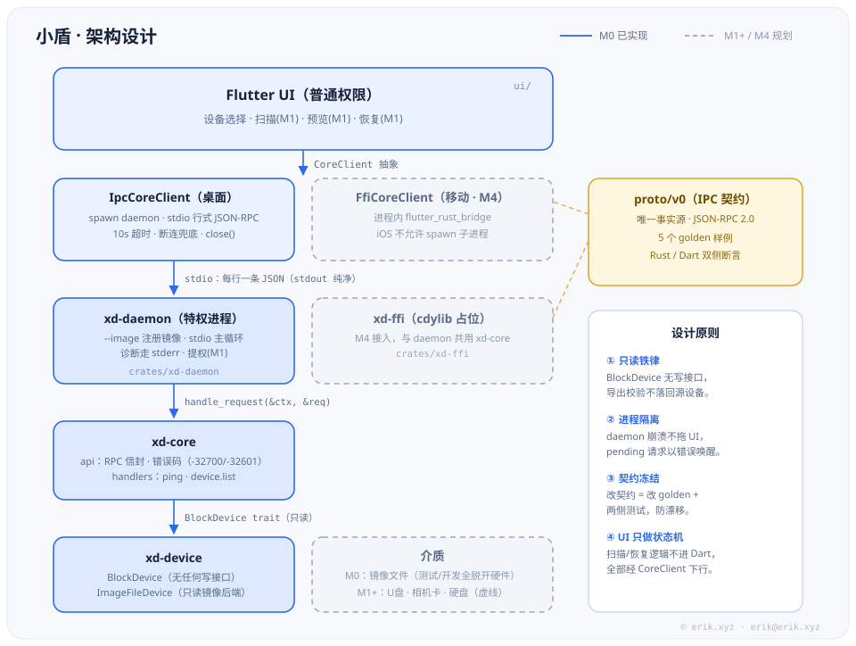
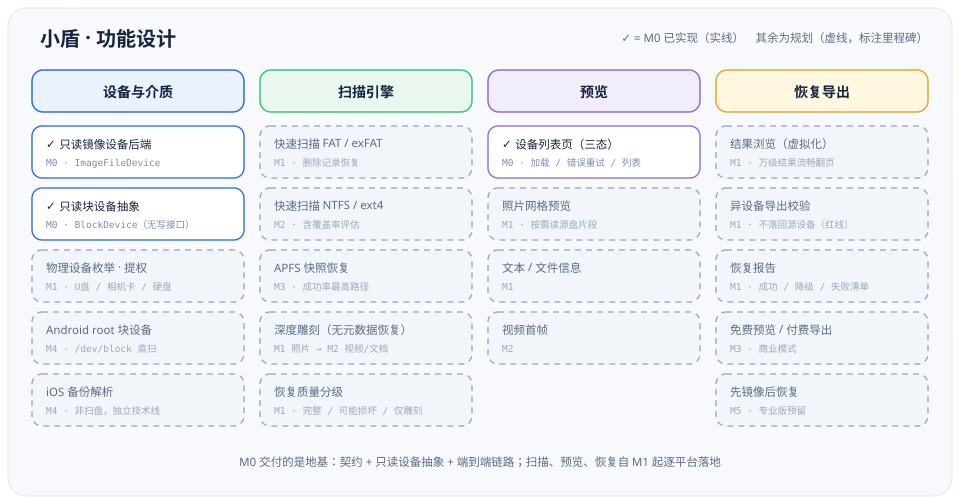
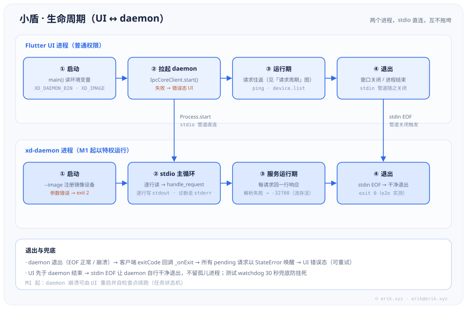
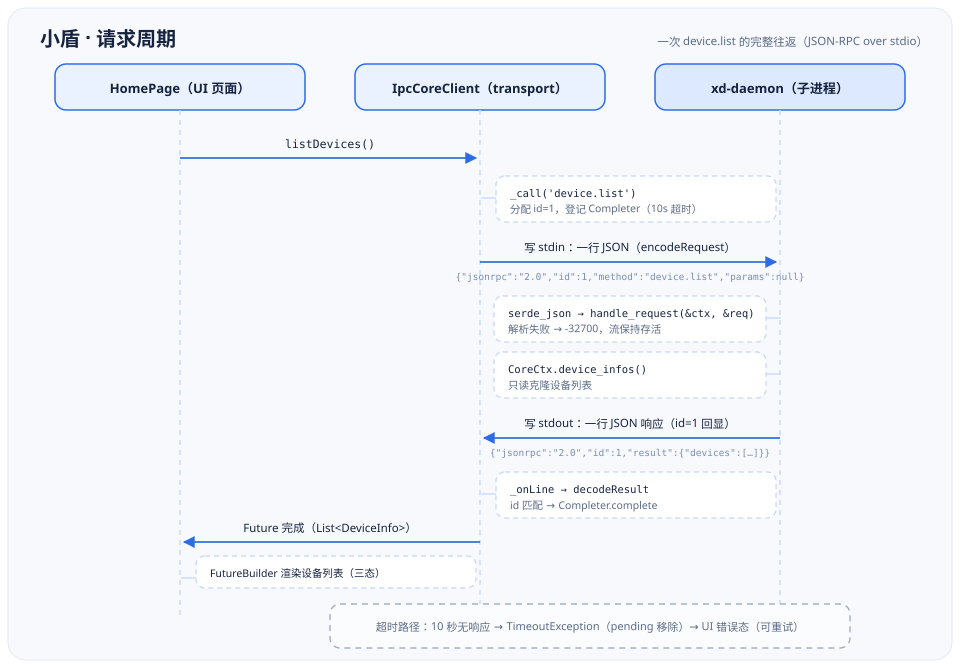

<p align="center">
  
</p>

<h1 align="center">小盾 (ssd)</h1>

<p align="center">跨平台数据恢复工具 · Flutter 界面 + Rust 引擎</p>

> 项目吉祥物「小盾」——一面会帮你把丢失文件找回来的小盾牌。

## 简介

小盾是一个面向个人用户的全平台数据恢复工具：误删的文件、格式化的 U 盘、
相机卡里的照片和视频，小盾帮你扫描、预览、找回来。

- **界面**：Flutter，一份代码覆盖桌面与移动端
- **引擎**：Rust，核心逻辑与界面彻底分离，性能与安全并重
- **原则**：对源介质**只读**，恢复导出严格校验不落回源设备

## 支持范围

### 介质

| 介质 | 典型文件系统 | 阶段 |
|---|---|---|
| U盘 | FAT32 / exFAT / NTFS | M1 → M2 |
| SD / TF / 相机卡 / 行车记录仪 / 无人机卡 | FAT32 / exFAT | M1 |
| 移动硬盘（USB HDD/SSD） | NTFS / exFAT / APFS / ext4 | M2-M3 |
| 手机（Android 内部存储） | ext4 / f2fs（需 root） | M4 |
| iPhone | 非块设备 → 走备份解析 | M4 |

只要设备在系统中表现为块设备即可，与内置磁盘走同一条通路。

### 恢复能力

- **删除文件恢复**（快速扫描）：文件名、目录结构、时间戳完整找回，附恢复质量分级（完整 / 可能损坏 / 仅雕刻）
- **深度扫描**（文件雕刻）：元数据已丢失也能按文件签名找回，照片、视频、文档按类型归类
- **APFS 快照恢复**（macOS）：从快照直接读取历史版本，成功率最高
- **iOS 备份解析**：从 iTunes / Finder 本地备份中找回残留记录
- **Android root 块设备恢复**

### 软件层面无解的情况（诚实说明）

1. 介质物理损坏（控制器故障、掉固件）——需开盘 / 芯片级服务
2. 硬件加密盘——不通过厂商工具无法读取
3. TRIM 已执行——部分 SSD 与支持 TRIM 的卡删除后物理不可逆
4. 覆盖写入过多——发现数据丢失后请**立即停止写入该介质**，这是成功率的头号因素

## 架构设计

<p align="center">
  
</p>

核心思路：**UI 与引擎彻底分离**。

- **Flutter UI（普通权限）**只做状态机与展示；所有扫描/恢复逻辑经 `CoreClient` 抽象下行
- **桌面端**引擎跑在独立的特权 daemon 进程里（stdio 行式 JSON-RPC），UI 崩溃或 daemon 崩溃互不拖垮
- **移动端**（M4）进程内嵌 FFI——iOS 不允许 spawn 子进程
- **`proto/v0` 是唯一契约**：Rust 与 Dart 两侧对同一组 golden 样例做解码 + 编码双向断言，改契约必须三处同步
- **只读铁律由类型系统保证**：`BlockDevice` 没有任何写接口

## 功能设计

<p align="center">
  
</p>

四个功能域按里程碑推进：M0 交付地基（契约 + 只读设备抽象 + 端到端链路），
扫描、预览、恢复自 M1 起逐平台落地。

## 生命周期

<p align="center">
  
</p>

两个进程、一条 stdio 管道：UI 拉起 daemon → 握手 → 请求往返 → UI 退出时
管道关闭、daemon 自行干净退出（不留孤儿进程）；daemon 若异常退出，
所有 pending 请求以错误唤醒，UI 落错误态可重试。

## 请求周期

<p align="center">
  
</p>

一次请求就是一行 JSON 的往返：UI 写入 stdin → daemon 逐行处理 → stdout 回写
→ 客户端按 id 匹配 Completer。10 秒无响应触发超时路径，UI 落错误态。

## 项目结构

```
ssd/
├── crates/                     # Rust workspace
│   ├── xd-core/                #   RPC 信封 + 处理器（ping / device.list）
│   ├── xd-device/              #   只读块设备抽象 + 镜像后端（BlockDevice / ImageFileDevice）
│   ├── xd-daemon/              #   桌面特权进程（stdio JSON-RPC 服务）
│   └── xd-ffi/                 #   移动端 FFI 占位（M4 接入 flutter_rust_bridge）
├── proto/v0/                   # IPC 契约 + 5 个 golden 样例（唯一事实源）
│   └── examples/               #   Rust / Dart 双侧测试的共同断言目标
├── ui/                         # Flutter 应用（全平台同一套）
│   ├── lib/core_client/        #   CoreClient 抽象 · 协议模型 · IpcTransport
│   ├── lib/home_page.dart      #   设备列表页（三态）
│   └── test/                   #   golden 契约测试 + widget / 集成测试
├── fixtures/                   # 确定性测试镜像生成脚本
├── scripts/                    # 端到端冒烟（scripts/e2e.sh）
├── docs/                       # 设计文档 · 实施计划 · 图示素材
└── .github/workflows/          # CI：Rust 三平台矩阵 + Flutter job
```

详细设计见 [设计文档](docs/superpowers/specs/2026-10-02-xiaodun-design.md)。

## 使用说明

### 环境要求

- **Rust** stable（edition 2024，≥ 1.97）
- **Flutter** 3.47.5 stable（CI 固定此版本；其他版本未验证）

### 运行桌面应用

```bash
# 1. 构建 daemon
cargo build -p xd-daemon

# 2. 生成一个测试镜像（M1 前没有真实设备枚举，先用镜像演示）
bash fixtures/gen_image.sh /tmp/xiaodun.img 1048576

# 3. 启动 UI：XD_DAEMON_BIN 指向 daemon，XD_IMAGE 把镜像注册为设备
cd ui && XD_DAEMON_BIN=../target/debug/xd-daemon XD_IMAGE=/tmp/xiaodun.img flutter run -d linux
```

（Windows 下两个环境变量改用 `$env:XD_DAEMON_BIN = "..\target\debug\xd-daemon.exe"` 语法设置。）

### daemon 命令行

```
xd-daemon [--image <path>]... [--db <path>]
```

- 从 stdin 逐行读 JSON-RPC 2.0 请求，逐行向 stdout 回响应；日志与诊断一律走 stderr
- `--image` 可重复，把镜像文件注册为只读设备（M0 的设备来源）
- `--db`：扫描任务与结果库（缺省 `$XDG_STATE_HOME/xiaodun/tasks.db`，回退 `~/.local/state/…`；
  打不开则降级内存库并 stderr 留痕——重启后结果不保留）
- 扫描经 `scan.start/status/results/pause/resume/cancel` 驱动，`scan.progress/finished` 为服务端通知（契约见 `proto/v1/README.md`）
- 参数错误或镜像打不开：stderr 输出原因并以退出码 2 结束

```bash
# 直接试一条请求
echo '{"jsonrpc":"2.0","id":1,"method":"ping","params":null}' | ./target/debug/xd-daemon
```

### 测试

```bash
cargo test --workspace        # Rust：契约 golden + 处理器 + 集成（含真实二进制黑盒）
bash scripts/e2e.sh           # 端到端冒烟：构建 → 生成镜像 → 发请求 → 断言

cd ui && flutter test         # UI：协议 golden + widget 测试
cd ui && XD_DAEMON_BIN=../target/debug/xd-daemon flutter test   # 追加真实 daemon 握手用例
```

## 路线图

| 阶段 | 内容 | 出口标准 |
|---|---|---|
| M0 地基 | workspace、契约冻结、设备抽象（含镜像文件后端）、最小 IPC | 端到端握手通 |
| M1 首个端到端 | FAT/exFAT + 照片雕刻 + 扫描/预览/恢复三页 | 真 U 盘删照片 → 扫到 → 恢复成功 |
| M2 桌面三平台 | NTFS、ext4 引擎；macOS / Linux 集成 | 三平台安装包 |
| M3 产品化 | 付费导出、APFS、性能打磨 | 可上架销售的桌面 1.0 |
| M4 移动线 | Android root、iOS 备份解析 | 移动端上架 |
| M5 专业版 | 磁盘镜像、扇区编辑、批量工单 | 方向预留 |

## 项目状态

**M1 进行中**。已完成并发布：
- **M0 地基**（v0.1.0）：契约 v0、只读镜像后端、stdio daemon、Flutter 骨架、CI 三平台矩阵
- **M1a / M1a2 / M1e**（v0.2.0）：FAT12/16/32 与 exFAT 只读引擎、Linux 平台层（枚举/提权/打包）
- **M1b**（本次合入）：契约 v1（`scan.*` 事件流）+ 扫描编排端到端——状态机（暂停/恢复/取消）、
  崩溃隔离（worker panic 不落 daemon）、SQLite 流式落盘（重启可查/中断恢复）、daemon 并发接线
  （stdout 串行化、`--db`、懒打开防提权面）

M1 剩余切片：照片雕刻（JPEG/PNG）、扫描/预览/恢复三页 UI、Windows/macOS 平台层与打包。
目标：全端 1.0 约 9-12 个月（5-6 人团队，4 条工作流并行）。

---

© 2026 erik · https://erik.xyz · erik@erik.xyz
